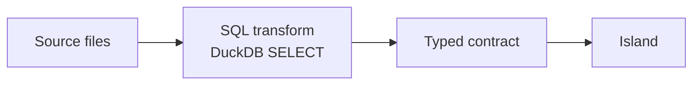

A `sql` dataset is a saved DuckDB query over your other datasets. It's where data shaping
lives: the sums, joins, and filters an island must never carry. The manifest stays
declarative because the arithmetic happens here, in a file you own, and the island only ever
names columns that already exist.



## Why shaping belongs in SQL

An island config names fields; it never computes them. You don't put a `SUM`, a `GROUP BY`, or
a join inside an island, because that buries logic in a layer that can't validate it and can't
be reused. Move the computation into a transform and two things follow: the shaped table can
feed several islands, and `validate` can check every binding against real, materialized
columns.

## Writing one

Drop a `.sql` file under `models/` (the convention is `models/transforms/`) and register it as
a dataset by its `sql` path:

```jsonc title="manifest.json"
"datasets": {
  "transactions": { "source": "data/transactions.csv" },
  "monthly":      { "sql": "models/transforms/monthly.sql" }
}
```

The file is a single DuckDB `SELECT`. It reads your other datasets by their dataset name, as
if each were a table:

```sql title="models/transforms/monthly.sql"
-- models/transforms/monthly.sql
SELECT
  date_trunc('month', ts) AS month,
  SUM(amount_eur)         AS spend_eur,
  COUNT(*)                AS txns
FROM transactions
GROUP BY 1
ORDER BY 1;
```

Now a `timeseries.line` binds to `monthly` with `x: "month"` and `y: "spend_eur"`, and every
value it reads is a column DuckDB computed once.

Each dataset registers as a DuckDB view named after the dataset, so a transform can use the
full dialect: joins, CTEs, window functions, date math, anything DuckDB supports. A trailing
semicolon is fine. The file must be one statement, a `SELECT` optionally led by a `WITH`.

## Transforms can build on transforms

Because every dataset is a view, a transform can read another transform, not only a file. The
one rule is order. Datasets register in the order they appear under `datasets`, so a transform
has to be declared after everything it reads:

```jsonc title="manifest.json"
"datasets": {
  "transactions": { "source": "data/transactions.csv" },
  "monthly":      { "sql": "models/transforms/monthly.sql" },     // reads transactions
  "monthly_net":  { "sql": "models/transforms/monthly_net.sql" }  // reads monthly, declared after it
}
```

<Callout type="warn">

A transform that references a dataset declared later in `datasets` fails to register: the view
it needs doesn't exist yet. Put upstream datasets first.

</Callout>

## Derived and read-only

A `sql` dataset is derived. It's a query, not a file, so nothing can write to it: no
[action](/data/actions) and no [connector](/data/connectors) may target it. Data flows one
way, from the `source` files it reads, through the `SELECT`, into the islands. To change what a
transform returns, change its SQL or the files beneath it.

A transform renders to islands and takes no parameters. For a parameterized, on-demand read over a
dataset — one an agent calls and gets rows back from, not a chart — declare a
[query](/data/queries) instead. A query is a declarative spec the compiler turns into SQL, and it
often points at a transform: the transform does the joins and shaping, the query parameterizes the
read.

## The binding check still applies

Islands bind to a transform's *output* columns, and `validate` checks them against the live
result. The compiler materializes the view, asks DuckDB for its columns and types, and rejects
any island bound to a column the `SELECT` doesn't produce, naming the page, the island, and the
missing field. Rename a column in the SQL and forget to update the island, and the build fails
loudly instead of rendering an empty chart. It works upstream too: drop a column from a source
CSV that the transform selects, and the error surfaces the moment you validate.

## Where to go next

- [Data Contracts](/concepts/data-contracts): the three dataset shapes and the contract check.
- [Actions](/data/actions): typed writes into the `source` files a transform reads.
- [The Manifest](/concepts/manifest): how datasets and islands fit together.
