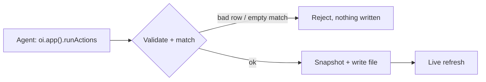

An action is a typed write into a `source` dataset. It's how new rows reach your data through
the same checkpointed path the agent edit loop uses: validated before anything touches disk,
snapshotted before the write, reversible after. You declare an action in the manifest; an agent
runs it over [MCP](/mcp).



## What an action can write

Only a `source` dataset. A file-backed dataset (CSV, JSON, JSONL) or a SQLite table takes
inserts. A derived [`sql` dataset](/concepts/sql-transforms) never does, because it's a query,
not a file. Pointing an action at a `sql` dataset is a named validation error.

## Declaring one

An action names its target dataset and a `mode`. Four modes are available:

| Mode | What it does |
| --- | --- |
| `insert` | Appends rows (default). |
| `replace` | Overwrites **all** rows in the dataset with the new rows. |
| `delete` | Drops rows where every column in the `match` predicate equals the given value (equality, multi-column AND). An empty `match` is rejected. |
| `update` | Patches matching rows: `match` selects the rows, `set` applies the new values. An empty `match` is rejected. |

```jsonc title="manifest.json"
"actions": {
  "log_meal": {
    "dataset": "meals",
    "mode": "insert"
  },
  "delete_meal": {
    "dataset": "meals",
    "mode": "delete"
  },
  "fix_meal": {
    "dataset": "meals",
    "mode": "update"
  }
}
```

The match predicate and new values for `delete` and `update` are passed **at call time** via
`runActions`, not in the manifest. `match` is equality-only in v1 — no ranges or operators.

That alone inserts rows whose columns match the `meals` data. Most actions add a `fields` block
to constrain or annotate specific columns.

## The row schema

An action carries no hand-written schema. It derives one from the live data: the compiler
infers each column's type from the dataset, then layers your `fields` overrides on top. The
result is a strict schema (unknown columns are rejected) that an agent reads before it sends a
single row.

A `fields.<column>` entry narrows one column:

```jsonc title="manifest.json"
"actions": {
  "log_meal": {
    "dataset": "meals",
    "mode": "insert",
    "fields": {
      "meal_type": { "enum": ["breakfast", "lunch", "dinner", "snack"] },
      "calories":  { "type": "number", "min": 0 },
      "source":    { "default": "manual" }
    }
  }
}
```

Each override key does one job:

- `type`: constrain the column to `string`, `number`, `boolean`, or `date`, overriding what was
  inferred.
- `enum`: restrict a string column to a fixed set of values.
- `min` / `max`: numeric bounds.
- `default`: a value applied when a row omits the column.
- `description`: a note that rides along with the schema, so the agent knows what the column
  means.

A key in `fields` that doesn't match a real column is an error. You can only override columns
that exist.

## What happens on a write

An agent calls `oi.app().runActions([{ action, rows? }])`. Before a single byte lands:

- **Every row (for `insert` / `replace`) is validated** against the resolved schema. One bad
  row (wrong type, a value outside `min`/`max`, an unknown column) rejects the whole call with
  an error naming the row index and the field, and nothing is written.
- **For `delete` / `update`, the `match` predicate is checked** — an empty `match` is rejected
  outright to prevent an accidental full-table wipe.
- **The target file is snapshotted** to `.openislands/history/`, so every write is reversible
  with `rollback`.

Then the write lands: rows appended or replaced in a flat file, or the matched rows deleted /
patched. A SQLite insert needs the file and table to exist already; a flat file is created if
it's missing.

All writes are all-or-nothing and path-confined: an action can only write the one `source` file
its dataset names. There is no general file write.

<Callout type="warn" title="No null in flat files">
CSV and other flat-file datasets store no null. Pass `""` for an empty string value, or omit
the field entirely to apply its `default`. Sending `null` in a row is a validation error.
</Callout>

## Running an action

Actions belong to the agent edit loop, not to a CLI command. An agent:

1. Calls **`oi.app().listActions()`** to get each declared action and its resolved row JSON Schema
   (the live schema merged with `fields`). That schema is its grounding for a valid row.
2. Calls **`oi.app().runActions([...])`** with one call object per action:

| Mode | Call shape |
| --- | --- |
| `insert` | `{ action, rows: [{ col: val, ... }, ...] }` |
| `replace` | `{ action, rows: [{ col: val, ... }, ...] }` |
| `delete` | `{ action, match: { col: val, ... } }` |
| `update` | `{ action, match: { col: val, ... }, set: { col: newVal, ... } }` |

Multiple calls in one `runActions` are atomic by default — if any call fails validation,
nothing is written; a mid-batch write failure rolls back earlier writes automatically.

<Callout type="info" title="Note">

Because every mutation is schema-checked and snapshotted before it runs, data that tries to
talk an agent into a bad write still can't get past validation or escape `rollback`.

</Callout>

## Surfacing an action to humans

An action isn't agent-only. Drop a [`form.entry`](/islands/content-and-layout#formentry) island on a
page and point it at an action, and the runtime renders a form — one typed input per field, the
action's types, enums, ranges, and defaults carried straight through — with a submit button that
inserts a row. It runs the very same write path `runActions` does: validate, snapshot, insert, then
the bound dataset's islands refresh live. The form is the human-facing mirror of the agent call,
authored by reusing the action rather than re-declaring its fields.

See [MCP Server](/mcp) for Code Mode and the full `oi` API, and [Connectors](/data/connectors) for
syncing a provider's data into `source` datasets on a schedule, through this same write path.
