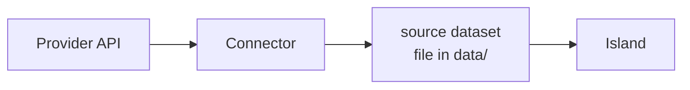

A connector syncs an external provider's data into your `source` datasets. It pulls from an
API, shapes the rows, and writes them through the same checkpointed path [actions](/data/actions)
use, so a sync is as reversible as any other write. The code lives in your project, the manifest
declares an instance of it, and authorization happens in the dashboard, never from an agent.



## Using a connector

A connector is a directory under `connectors/` whose name is the connector's name, mirroring
custom islands. Adopting one is three steps: copy the directory in, declare it, set its secrets.

### Declare it

Add an entry under `connectors`, parallel to `actions`:

```jsonc title="manifest.json"
"connectors": {
  "whoop": {
    "module": "connectors/whoop",                  // the directory, relative to the project root
    "datasets": { "recovery": "whoop_recovery" },  // connector output -> your source dataset
    "schedule": "6h",                              // optional, overrides the connector's default
    "config": { "lookbackDays": 30 }               // optional, validated by the connector's schema
  }
}
```

`datasets` maps each of the connector's declared **outputs** to a writable `source` dataset in
your manifest. Every key must be one of the connector's outputs, and every value must name a
`source` dataset, never a [`sql` transform](/concepts/sql-transforms). `validate` loads the
module, parses `config` against the connector's own schema, and checks the outputs and schedule,
so a typo'd output name or a bad config is a named error before anything runs.

### Authorize it

How a connector authorizes depends on the auth mode its code declares:

- **Keyless.** A connector that uses a plain API key declares its key env vars in `secrets` and
  reads them from `.env`. Nothing to click — it's connected once every secret is set.
- **OAuth2.** A connector that talks to an OAuth provider needs its client credentials in `.env`
  (the connector declares which keys, e.g. `WHOOP_CLIENT_ID` and `WHOOP_CLIENT_SECRET`), then a
  one-time sign-in. Authorization is human-only: run `openislands serve`, open the dashboard, and
  click **Connect**. The runtime walks the OAuth flow in the browser and stores the resulting
  tokens at `.openislands/connectors/<name>.json` (gitignored). An agent never authorizes on its
  own; if a sync reports a connector isn't connected, it asks you to.
- **Bearer.** A connector that takes a static long-lived API token or JWT declares the `.env` key
  holding it (`tokenEnv`). You paste the token into `.env` and that's it — there's no Connect
  click, like a keyless connector. It's connected once the env var is set, and the token is handed
  to `sync` as `ctx.tokens.accessToken`, identical to an OAuth access token.

### Sync it

Once connected, rows arrive three ways:

- **On a schedule.** The runtime runs each connector on its `schedule`, syncing right away if
  it's overdue and on the interval after that.
- **From the CLI.** `openislands sync` pulls every configured connector once and exits;
  `openislands sync . whoop` runs a single one. Cron this for a headless refresh.
- **From an agent.** `oi.app().runSync(name)` over [MCP](/mcp) pulls and writes, returning
  rows-per-dataset and a `checkpoint_id`.

Every path writes through the snapshot-before-write machinery, so `rollback` undoes a sync the
same as it undoes an edit.

## Building a connector

A connector is a single `index.ts` that default-exports `defineConnector({ ... })` from
`@openislands/connector-kit`:

```text
connectors/whoop/
  index.ts    # default-exports defineConnector({ ... })
```

```ts title="connectors/whoop/index.ts"
import { defineConnector } from "@openislands/connector-kit";
import { z } from "zod";

export default defineConnector({
  description: "Whoop recovery, sleep, and workouts",
  config: z.object({
    lookbackDays: z.number().int().positive().default(30),
  }),
  schedule: "6h",
  auth: {
    type: "oauth2",
    data: {
      authorizeUrl: "https://api.prod.whoop.com/oauth/oauth2/auth",
      tokenUrl: "https://api.prod.whoop.com/oauth/oauth2/token",
      scopes: ["read:recovery", "read:sleep", "offline"],
      clientIdEnv: "WHOOP_CLIENT_ID",
      clientSecretEnv: "WHOOP_CLIENT_SECRET",
    },
  },
  outputs: {
    recovery: { description: "daily recovery score, replaced each sync" },
    sleep: { description: "per-sleep records, inserted by cursor" },
  },
  async sync(ctx) {
    const rows = await fetchRecovery(ctx.tokens!.accessToken, ctx.config.lookbackDays);
    await ctx.replace("recovery", rows);
    // ...
  },
});
```

### outputs

`outputs` declares the named tables this connector produces. The manifest's `datasets` keys
must be a subset of them, and each output carries an optional `description`. An author decides,
per output, whether a sync inserts or replaces it.

### config

An optional Zod schema. The runtime parses the manifest's `config` block against it and hands
the result to `sync` as `ctx.config`, fully typed. A config that fails the schema is caught at
`validate`.

### auth

A connector picks one of three auth modes:

- **Keyless.** Omit `auth` and list its API-key env vars in `secrets: ["SOME_API_KEY"]`; they
  arrive as `ctx.secrets`. Connected once every secret is set.
- **OAuth2.** Set `auth.type` to `"oauth2"` and give it the provider's `authorizeUrl`, `tokenUrl`,
  the `scopes` to request, and the `.env` keys holding the client id and secret. The runtime owns
  the rest: the Connect flow, token storage, and refreshing an access token that's about to expire
  before each sync.
- **Bearer.** Set `auth.type` to `"bearer"` and name the `.env` key holding a static long-lived
  API token or JWT in `data.tokenEnv`. There's no Connect flow: the runtime reads the env token
  and hands it to `sync` as `ctx.tokens.accessToken`, exactly like an OAuth access token, so your
  request code (`Authorization: Bearer …`) is the same either way. Connected once the env var is
  set.

```ts title="connectors/acme/index.ts"
export default defineConnector({
  description: "Reads a service behind a static API token",
  auth: { type: "bearer", data: { tokenEnv: "ACME_API_TOKEN" } },
  outputs: { events: { description: "appended events" } },
  async sync(ctx) {
    const res = await fetch("https://api.acme.dev/events", {
      headers: { authorization: `Bearer ${ctx.tokens!.accessToken}` },
    });
    await ctx.insert("events", await res.json());
  },
});
```

### sync(ctx)

The heart of a connector. It receives a context, writes rows, and returns nothing. The context
gives you:

- `ctx.config`: the parsed config.
- `ctx.secrets`: the declared `.env` secrets, keyed by name.
- `ctx.tokens`: for an OAuth connector, `{ accessToken, refreshToken?, expiresAt? }`, refreshed
  automatically when it's near expiry; for a bearer connector, `{ accessToken }` carrying the
  static token from `.env`. Absent for keyless connectors.
- `ctx.state`: a mutable object that persists between syncs. Keep a cursor here (the timestamp
  or id you last pulled) so the next run fetches only what's new. It's saved after a successful
  sync.
- `ctx.insert(output, rows)`: append rows to an output's dataset. For immutable records, a
  workout that happened, a sleep that's logged. Advance a cursor in `ctx.state` so you don't
  re-insert them next time.
- `ctx.replace(output, rows)`: overwrite an output's dataset wholesale. For records the provider
  revises after the fact, like a recovery score that gets recomputed, where the latest pull is
  the truth.
- `ctx.log(message)`: a line in the sync log.

Insert versus replace is chosen per output by which method you call, and a connector can do
both: replace the volatile outputs, insert-and-advance the append-only ones. You shape the rows
in your own code. The first sync into an empty dataset takes whatever columns you write; later
syncs are checked against the dataset's settled schema.

<Callout type="info" title="Note">

Tokens and `ctx.state` live together at `.openislands/connectors/<name>.json`, outside your data
files and outside git. The dataset files hold only rows.

</Callout>

### Types without an install

Your project's `package.json` and `tsconfig.json` (scaffolded by `init`) exist so `connectors/`
and `components/custom/` typecheck in your editor. Run `npm install` once and
`@openislands/connector-kit` and `zod` resolve for the type checker. The runtime never uses the
project's `node_modules`: it bundles the connector on demand and resolves both packages to its
own copies.

## Status and troubleshooting

`oi.app().listConnectors()` over MCP, `openislands sync`, and the dashboard all read the same status
per connector:

- `connected`: OAuth is complete, the bearer token env var is set, or for a keyless connector,
  every secret is present.
- `missingSecrets`: env keys the connector needs that aren't set.
- `lastSync` / `lastError`: when it last ran, and why it failed if it did.
- `schedule`: the effective interval, the manifest's value falling back to the connector's
  default.
- `loadError`: the module failed to compile, or didn't export a valid connector.

A complete OAuth2 reference connector lives at `apps/examples/health/connectors/whoop/`: three
outputs, a cursor for the append-only ones, and a full pull-and-shape `sync`.

## Where to go next

- [Actions](/data/actions): the manual write path connectors build on.
- [Data Contracts](/concepts/data-contracts): what makes a dataset a writable `source`.
- [MCP Server](/mcp): `oi.app().listConnectors()` and `runSync` inside the agent loop.
