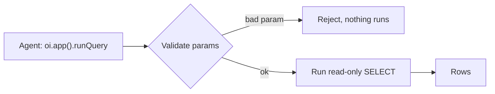

A query is the read mirror of an [action](/data/actions). Where an action is a typed write into a
`source` dataset, a query is a typed, read-only read over one dataset, declared in the manifest
and called on demand. You don't write SQL: a query is a declarative spec (a dataset, optional
filters, a projection, an order) that the compiler translates to a parameterized `SELECT`. You
declare a query; an agent runs it over [MCP](/mcp) with `oi.app().runQuery`.



## Why declarative

A query is a spec, not raw SQL in a JSON string. The compiler reads the spec and emits the SQL.
That buys five things:

- **No casting footgun.** The translator emits type-aware casts itself. You never write a
  `TRY_CAST` or an `ILIKE`; you name a field and an op and it compiles to the right comparison.
- **Fields are validated.** Every `field` you reference is checked against the dataset's live
  columns at build time, like an island binding. A field that doesn't exist is a named error, not
  an empty result.
- **Injection-safe.** Every param and every literal `value` is bound, never interpolated. Only
  verified column identifiers are quoted into the SQL.
- **Agent-authorable.** The spec is plain JSON, so an agent writes a query through the normal
  `oi.app().patchManifest` → `applyEdit` loop, the same loop it uses for islands (see
  [Authoring queries](#authoring-queries)).
- **No joins by design.** A query reads one dataset. When a read needs joins or other heavy
  shaping, that lives in a [`sql` transform](/concepts/sql-transforms) the query's `dataset`
  points at.

## What a query reads

One dataset: a raw `source` dataset or a `sql` transform, named by `dataset`. Because a transform
is itself a dataset, a query over a transform reads already-shaped, already-joined columns. Think
of a query as a saved, named, typed version of the ad-hoc `oi.app().runSql` read, scoped to a
single dataset.

A query is the dual of a transform, not a replacement for one. A transform is a file-backed view
bound to islands: it renders, takes no parameters, and shapes data once. A query renders nothing,
takes parameters, and returns rows when called. A query often selects from a transform: let the
transform do the joins and aggregation, and let the query parameterize the read.

## Declaring one

A query names its `dataset` and, optionally, the `params` it accepts and how to `where` / `select`
/ `orderBy` / `limit` the rows:

```jsonc title="app/manifest.json"
"queries": {
  "get_daily_macros": {
    "description": "Macros + goals for one day; omit date for the latest.",
    "dataset": "macros_daily",
    "params": { "date": { "type": "date", "required": false } },
    "where": [{ "field": "date", "op": "eq", "param": "date" }],
    "orderBy": [{ "field": "date", "dir": "desc" }],
    "limit": 1
  }
}
```

That reads one row from `macros_daily`. With a `date`, it's that day; with no `date`, the filter
drops and the `orderBy` + `limit` return the latest row (see [Filters](#filters)).

### Parameters

`params` maps each parameter name to its declaration. A `where` clause references a param by name
in its `param` field; the value is bound when the query runs.

| Field | Type | Description |
| --- | --- | --- |
| `type` | `"string" \| "number" \| "boolean" \| "date"` | The parameter's type. Defaults to `string`. |
| `required` | `boolean` | Whether the caller must supply it. Defaults to `true`. `false` makes it optional. |
| `enum` | `array of string` | Restrict a string parameter to a fixed set of values. |
| `min` / `max` | `number` | Numeric bounds. |
| `default` | `string \| number \| boolean` | A value used when the caller omits it. Implies optional. |
| `description` | `string` | A note that rides along with the param, so the agent knows what it means. |

### Filters

`where` is a list of filters, ANDed together. Each names a `field`, an `op`, and exactly one of
`param` (bind a declared param) or `value` (a literal):

| Op | Match |
| --- | --- |
| `eq` / `ne` | Equal / not equal. |
| `lt` / `lte` / `gt` / `gte` | Ordered comparison. |
| `contains` | Case-insensitive substring. |
| `sameDay` | A timestamp field falls on a given date. |
| `in` | The field is one of a literal `value` array. |

A filter bound to an **optional** param the caller omits is **dropped**; the query runs as if the
filter weren't there. That's the latest-row pattern above: omit `date` and the day filter
disappears, leaving `order by date desc limit 1`.

### Projection

`select` is a list of columns to return; omit it for all of them. An entry is either a column name
or `{ field, fn?, as? }`, where `fn` is `sum`, `avg`, `count`, `min`, or `max`. Aggregates pair
with `groupBy`, a list of columns to group by:

```jsonc title="app/manifest.json"
"queries": {
  "spend_by_category": {
    "dataset": "transactions",
    "select": [{ "field": "category" }, { "field": "amount", "fn": "sum", "as": "total" }],
    "groupBy": ["category"],
    "orderBy": [{ "field": "total", "dir": "desc" }],
    "limit": 10
  }
}
```

`orderBy` is a list of `{ field, dir? }` sort keys (`dir` is `asc` or `desc`, default `asc`), and
`limit` caps the rows.

## Running a query

Queries belong to the agent edit loop, not to a CLI command. An agent:

1. Calls **`oi.app().listQueries()`** to get each declared query: its `name`, `description`, its
   `params` as a JSON Schema, and the result `columns`. That's its grounding for what to pass and
   what comes back.
2. Calls **`oi.app().runQuery(name, params?, { limit? })`**, which validates the params and runs the
   compiled `SELECT`. On success it returns `{ ok: true, rowCount, columns, rows }`. A bad param
   rejects the whole call with `{ ok: false, errors }` (all-or-nothing); an unknown name or a
   query error returns `{ ok: false, error }`. `limit` is 1–500 and the result is row-capped
   regardless.

## Authoring queries

Because a query is declarative JSON, an agent writes one end-to-end through the same
`oi.app().patchManifest` → `applyEdit` loop it uses for islands and actions. No new tool, no file
write. It reads the data, drafts the `queries` block, stages the change, reviews the diff, and
applies it. The MCP write path only ever writes `app/manifest.json`, so a JSON spec is what lets
an agent create a read tool, not just run one.

`patchManifest` / `replaceManifest` and `validate` enforce the same checks: the `dataset` must
exist, and every `field` in `where`, `select`, `groupBy`, and `orderBy` must be a real column on it.
A field that doesn't exist is a named error, caught before the manifest lands: the same fail-loud
binding check an island gets.

<Callout type="info" title="Note">

A query is read-only by construction: the compiler emits a single `SELECT`, every param and
literal is bound rather than interpolated, only verified column identifiers are quoted, and the
result is row-capped. Data that tries to talk an agent into a harmful read still can't escape
validation or the row cap.

</Callout>

## Where to go next

- [SQL Transforms](/concepts/sql-transforms): the file-backed views a query selects from.
- [Actions](/data/actions): the typed write a query mirrors.
- [MCP Server](/mcp): `oi.app().listQueries()` and `runQuery` inside the agent loop.
