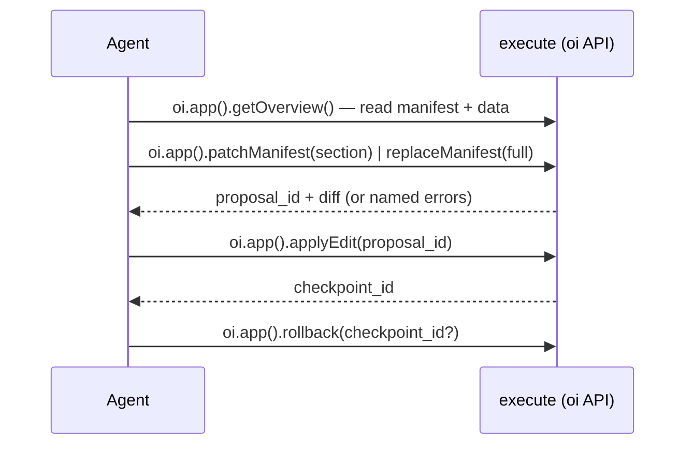

The MCP server is how an **agent** maintains a dashboard: safely, for months, without it
rotting. It's the primary way to run OpenIslands. It runs in **Code Mode** — instead of a tool per
operation, the agent calls **one tool, `execute`**, and passes it a small async JavaScript program
that drives the `oi` API. The whole surface sits on one principle:

> **Read many, write one.** An agent can read everything (the manifest, the schemas, the live
> data), but every change funnels through a single proposal-and-apply pipeline that validates
> before it writes and snapshots before it changes anything.

This is the moat. An agent can't hand-edit your files, can't ship a broken binding, and can't
make a change you can't undo.



## Wiring it up

The server ships as `@openislands/mcp`. Point your MCP client's config at your **project root** —
the workspace that holds your apps under `apps/<id>/`:

```jsonc title=".mcp.json"
{
  "mcpServers": {
    "openislands": {
      "command": "npx",
      "args": ["-y", "@openislands/mcp", "/path/to/your/project"]
    }
  }
}
```

The first positional argument is the project root: the server scans `apps/*`, and reads and writes
each app's manifest, data, and history under `apps/<id>/`. `npx` fetches and runs the latest
published server on demand; its `-y` flag skips the install prompt, so there's nothing to install
globally.

One server hosts the whole workspace. Inside a script, `oi.app(id)` picks an app; omit the `id` when
the project has a single app and it resolves automatically. With several apps, pass the `<id>`, or
you get an error naming the available ids — call `oi.listApps()` first to discover them.

## Running over HTTP

The config above runs the server over **stdio** — the client spawns it as a child process. For a
remote or always-on setup, the same server also speaks **Streamable HTTP** (the modern MCP
transport): `openislands serve --mcp`, or the [Docker image](/self-hosting), mounts it on the
dashboard's port at `POST/GET/DELETE /mcp`. One endpoint hosts the whole workspace — pick the app
inside the script with `oi.app(id)`, not in the URL. An HTTP-aware client points its `url:` at that
endpoint instead of spawning a command; the tool surface below is identical either way. Off loopback
it requires a bearer token — see [Self-hosting](/self-hosting) for the full deployment and security
story.

## Code Mode: one tool, driven with JavaScript

`execute` replaces the old per-operation tools — it's the **entire** tool surface (plus two
read-only resources, below). You write a small async JavaScript program that calls the `oi` API,
compose as many steps as you like in a single call (loops, conditionals, chaining), and `return` a
value and/or `console.log` what you want back. It runs in a `node:vm` sandbox — no `require`, no
`process`, no network, only `oi`. (`execute`'s own tool description carries the full `oi` TypeScript
API — read it once; the essentials are below.)

```js
const app = oi.app();                 // the sole app; oi.app("id") to pick one in a multi-app workspace
const ov = await app.getOverview();   // orient: manifest + live columns + actions/queries/connectors
console.log(ov.datasets);
return ov.title;
```

`execute` returns `{ ok, result, logs, checkpoints_created? }` — `result` is whatever you returned,
`logs` is your `console.log` output, and `checkpoints_created` lists every checkpoint the script
landed (the audit trail for a half-failed run). A thrown error comes back as `{ ok: false, error,
logs }`.

Every operation — reads, SQL, the manifest edit pipeline, actions, queries, connectors, and even
creating or deleting an app — is a method on `oi`, reached from inside `execute`. There are no
separate per-operation tools to call; one tool means a tiny, stable context cost no matter how rich
the API grows, and the agent composes a whole read-ground-stage-apply loop without a round-trip per
step.

## The `oi` API

`oi.listApps()`, `oi.createApp({ id, title? })`, and `oi.deleteApp({ id })` are workspace-level.
`oi.app(id?)` returns the **app-scoped API** — omit `id` when there's only one app, else pass the
`<id>` under `apps/`. Every method returns a plain JSON object carrying an `ok` flag (the one
exception is `getManifest()`, which returns the raw manifest object). On `ok:false`, read `error` (or
`errors` — each names the page, island, and field) and fix it. Pass JSON **objects**, not JSON
strings.

### The read methods

An agent grounds itself before it ever proposes a change. These methods are all read-only:

| Method | What it returns |
| --- | --- |
| `app.getOverview({ verbosity? })` | **Start here.** The manifest, every dataset's live columns, and the declared actions / queries / connectors (with status), plus the rollback checkpoint count — one call instead of a `getManifest` + a `getDataSchema` per dataset + `listActions` / `listQueries` / `listConnectors` fan-out. Concise by default; pass `verbosity: 'detailed'` to also include per-action row schemas and per-query params + result columns. |
| `app.listIslands()` | The built-in island types, the fields each requires, and each one's `minSpan` / `recommendedSpan` / `maxSpan`. |
| `app.getIslandSchema(type)` | The exact config schema for one island type, plus its `layout` (`{ minSpan, recommendedSpan, maxSpan }`) and `notes` — so the sizing rules reach you at discovery time. |
| `app.getManifest()` | The current manifest (the raw object). |
| `app.getDataSchema(dataset)` | A dataset's live, DuckDB-inferred columns and types. |
| `app.runSql({ dataset } \| { sql }, limit)` | Rows from a dataset, or a read-only `SELECT` over the registered dataset views. Alias: `app.previewDataset(dataset)`. |
| `app.validateSql(sql)` | Dry-runs a read-only `SELECT` against the dataset views; returns its result columns or the exact DuckDB error. |
| `app.validateManifest(manifest?)` | Validates a manifest (the one on disk, or one you pass) and checks every binding against the data; also returns advisory layout `warnings`. |
| `app.listCheckpoints()` | The rollback points, newest last. |

`runSql` takes a `dataset` name for a whole dataset *or* a read-only `sql` SELECT over the
dataset views, never both — it pairs with `validateSql` (the dry-run) and is the ad-hoc
counterpart to `runQuery` (a *saved, named, parameterized* read). Both are row-capped and take a
`verbosity` (`concise` default / `detailed`) that widens the output token budget. This is how an
agent confirms a column exists and what its values look like *before* binding an island to it.

`validateSql` is the same read-only surface, aimed at **authoring a transform**: pass the SQL you
intend to save as a `sql` dataset and get back its result columns, or the exact DuckDB error, before
you wire it into the manifest. See [CRUD recipes](#crud-recipes).

`getIslandSchema` and `listIslands` also carry each island's **span range** — its `minSpan`,
`recommendedSpan`, and `maxSpan` on the 12-column grid — so you can size a tile correctly before you
set `span`, not after `validate` rejects it. Compact islands (a `metric.kpi`, `funnel.steps`, the
gauges) cap well below 12; data-dense ones run the full width. See
[Spans and the grid](/concepts/manifest#spans-and-the-grid).

## Apps

A project is a **workspace**: every app lives under `apps/<id>/`, and one server hosts them all.
Three workspace-level methods on `oi` manage the set (they're not scoped to an app):

| Method | What it does |
| --- | --- |
| `oi.listApps()` | Lists the apps in the workspace — `{ apps: [{ id, title, dir }] }`. Call it first when a project might hold more than one app, then pass the chosen `id` to `oi.app(id)`. |
| `oi.createApp({ id, title? })` | Scaffolds `apps/<id>/` with a minimal starter manifest (one welcome note, empty `data/`). Errors if the `id` is unsafe or already taken. |
| `oi.deleteApp({ id })` | **Soft-archive** — moves `apps/<id>/` into the workspace's `.openislands/trash/`. It's reversible (nothing is hard-deleted), never a hard delete. |

Two read-only **resources** expose the same surface for clients that prefer resource reads to tool
calls: `openislands://apps` (the app list) and `openislands://apps/<id>/manifest.json` (one app's
current manifest).

## The manifest write path

Exactly one pipeline writes the manifest, in two steps with a human-reviewable diff between
them. An agent stages an edit (`patchManifest` or `replaceManifest`), reviews the returned diff,
then applies it.

| Method | What it does |
| --- | --- |
| `app.patchManifest({ ... })` | **The preferred editor.** Merges one or more sections into the current manifest, validates the result, and stages it. |
| `app.replaceManifest({ manifest })` | Stages a **full** manifest rewrite. |
| `app.applyEdit(proposal_id)` | Writes a staged proposal and snapshots the prior manifest. |
| `app.rollback(checkpoint_id?)` | Restores a snapshot byte-for-byte (the latest if no id). |

### `patchManifest` — the incremental editor

`patchManifest` is how an agent should normally edit the manifest. It takes a **partial**
manifest — `{ title?, icon?, datasets?, actions?, queries?, connectors?, pages?, remove_pages? }` —
merges it into the document on disk, validates the merged result against the live data, and returns
a unified `diff` plus a `proposal_id` (it writes **nothing** yet). You never re-send, or re-typo,
the whole manifest.

The merge follows the shape of each section:

- **Record sections** (`datasets`, `actions`, `queries`, `connectors`) are keyed maps. Each entry is
  upserted by name: `name → spec` adds or replaces that one entry, and **`name → null` deletes it**.
  Untouched entries are left alone.
- **`pages`** is a list, so it's upserted **by `id`**: a page whose `id` already exists is replaced,
  a new `id` is appended. **`remove_pages: ["id", …]`** deletes pages by id.
- **Scalars** (`title`, `icon`) are overwritten when present.

```js
// patchManifest — add one dataset and one page, delete a stale query, all in one call
const s = await app.patchManifest({
  datasets: { spending: { source: "data/spending.csv", description: "monthly spend" } },
  pages: [
    { id: "spending", title: "Spending", islands: [
      { type: "category.bar", title: "By category", dataset: "spending",
        x: "category", y: "amount_eur" },
    ] },
  ],
  queries: { legacy_rollup: null },
});
if (!s.ok) return s.errors;
return await app.applyEdit(s.proposal_id);
```

The validation is identical to `replaceManifest`'s: if a binding fails, you get
`{ ok: false, errors, diff }` (each error naming the page, island, and field) and **no**
`proposal_id`. Fix the patch and call again. On success: `{ ok: true, proposal_id, diff }`. Both
shapes also carry an advisory **`warnings`** array — the layout linter's non-blocking suggestions
(a lone `metric.kpi`, a compact island stretched past its recommended span). Warnings never set
`ok` to `false` or block the apply; they're a nudge toward a tidier layout, not a gate.

### `replaceManifest` — the full rewrite

**`replaceManifest({ manifest })`** takes the whole manifest when you really do want to replace it
end to end. It accepts a manifest **object** (preferred) or a JSON string — no double-encoding.
It validates the structure, checks every binding against the live data, and returns the same
`{ ok, proposal_id?, diff, errors?, warnings? }` shape as `patchManifest`. **Reach for
`patchManifest` first** — it's the preferred incremental editor; `replaceManifest` is for a full
rewrite or a brand-new manifest, where re-sending the whole document is the point.

A proposed manifest is validated **against itself**: new datasets, `sql` transforms, and markdown
sources introduced in the same edit resolve and bind correctly, even starting from an empty
manifest. `app.validateManifest(manifest?)` runs that same check (errors **and** advisory layout
`warnings`) without staging anything — pass a manifest object to dry-run it, or omit it to validate
the one on disk.

### Apply and roll back

**`applyEdit(proposal_id)`** writes a staged proposal (from either editor). Before writing it
**snapshots the current manifest** as a checkpoint and returns its `checkpoint_id`. A proposal is
rejected if it's unknown or **stale**: if the manifest on disk changed since it was staged (a
content-hash check), re-stage the edit. A `proposal_id` persists across `execute` calls, so you can
stage in one call and apply in the next.

**`rollback(checkpoint_id?)`** restores a checkpoint **byte-for-byte** (the latest if no id is
given). It restores the manifest *and* any data checkpoints, so it undoes data writes too.

History doesn't grow without bound: it auto-prunes to the newest few checkpoints after every
`applyEdit`. **`app.pruneCheckpoints(keep?)`** prunes it on demand — keeping the newest `keep`
checkpoints and deleting the rest — to reclaim space sooner or keep fewer. Trimmed checkpoints
become unrecoverable.

There is no raw file-write tool and no git dependency by design. Safety is the
stage/apply/rollback loop plus on-disk snapshots, not trust.

## CRUD recipes

Author against the live contract, stage with `patchManifest`, apply — usually one script. Each
recipe assumes `const app = oi.app();` at the top.

**Add a dataset from a file.** Drop the file under `data/` (or `models/` / `docs/` / `app/`), then
upsert it and confirm its inferred columns in one script:

```js
const s = await app.patchManifest({ datasets: { crypto: { source: "data/crypto.csv", description: "holdings" } } });
if (!s.ok) return s.errors;
await app.applyEdit(s.proposal_id);
return await app.getDataSchema("crypto");           // confirm columns before binding islands to it
```

**Add a SQL transform — dry-run it first.** `validateSql` lets you get the SQL right before it ever
touches the manifest:

```js
// 1. validateSql — returns the result columns, or the exact DuckDB error
const check = await app.validateSql("SELECT class, SUM(value_eur) AS value_eur FROM holdings GROUP BY class");
if (!check.ok) return check.error;
// 2. once it's valid, save it under models/ (with your file tools) and wire it in
const s = await app.patchManifest({ datasets: { allocation: { sql: "models/transforms/allocation.sql" } } });
return s.ok ? await app.applyEdit(s.proposal_id) : s.errors;
```

A transform can read any other dataset by its name; `validateSql` resolves those same views.

**Add an island to a page.** A page is upserted by `id`, so read the page, append the island, and
send just that page back (everything you omit on the page is replaced, so include the existing
islands):

```js
const ov = await app.getOverview();
const page = ov.pages.find((p) => p.id === "overview");
page.islands.push({ type: "rank.list", title: "Top assets", dataset: "allocation",
                    label: "class", value: "value_eur", span: 6 });
const s = await app.patchManifest({ pages: [page] });
return s.ok ? await app.applyEdit(s.proposal_id) : s.errors;
```

**Remove something.** Set a record entry to `null`, or list page ids in `remove_pages`:

```js
return await app.patchManifest({ queries: { by_class: null }, actions: { log_txn: null }, remove_pages: ["scratch"] });
```

## The data write path: actions

Actions are typed writes into a `source` dataset, declared in the manifest. Four modes are
available: `insert` (append), `replace` (overwrite all rows), `delete` (drop rows matching a
predicate), and `update` (patch matching rows). The agent discovers and runs them:

- **`app.listActions()`** returns each declared action with its **resolved row JSON Schema**
  (derived from the live data, merged with the action's `fields` overrides). This is the
  agent's grounding for what a valid row looks like.
- **`app.runActions([...])`** accepts a call per action. The call shape depends on the mode:
  - `insert` / `replace`: `{ action, rows: [{ col: val }, ...] }`
  - `delete`: `{ action, match: { col: val, ... } }` — equality match, multi-column AND; empty `match` is rejected.
  - `update`: `{ action, match: { col: val }, set: { col: newVal } }`

  Every row is validated against the resolved schema before a single byte lands. A bad row
  (or an empty `match`) rejects the whole call, and **nothing is written.** On success the
  target file is snapshotted (so `rollback` covers it) and the result reports rows affected
  plus a `checkpoint_id`. Multiple calls in one `runActions` are atomic by default.

Writes are all-or-nothing and path-confined to the project: an action can only write the
`source` file its declared dataset names.

<Callout type="warn" title="No null in flat files">
CSV and other flat-file datasets store no null. Pass `""` for an empty string, or omit the
field to apply its `default`. Sending `null` is a validation error.
</Callout>

## The read query path: queries

Queries are typed, read-only reads over a dataset, declared in the manifest. They're the read
mirror of actions: a saved, named, parameterized version of `runSql`. A query is a declarative
spec — a dataset, filters, a projection — that the compiler translates to a parameterized
`SELECT`, not raw SQL. The agent discovers and runs them:

- **`app.listQueries()`** returns each declared query with its `name`, `description`, its `params` as
  a **JSON Schema**, and the result `columns`. This is the agent's grounding for what to pass and
  what comes back.
- **`app.runQuery(name, params?, { limit? })`** validates the params, then runs the compiled
  `SELECT`. On success it returns `{ ok: true, rowCount, columns, rows }`. A bad param rejects the
  whole call with `{ ok: false, errors }` (all-or-nothing); an unknown name or a query error returns
  `{ ok: false, error }`. `limit` is 1–500 and the result is row-capped either way. Params and
  literals are bound, never interpolated, and every `field` is validated against the live columns.

A query is plain JSON in the manifest. Because the only thing the write path writes is the
manifest, an agent authors a query through the normal `patchManifest` / `applyEdit` loop, exactly
like an island or an action — it creates the read tool, it doesn't just run one.
See [Queries](/data/queries) for the full shape.

## Connectors

Connectors sync an external provider's data into `source` datasets on a schedule, through the
same checkpointed write path. The agent's two methods:

- **`app.listConnectors()`** returns each connector's live status: `connected`, `missingSecrets`,
  `lastSync`, `lastError`, effective `schedule`, and any `loadError`. This is how an agent
  discovers whether a connector needs human action before it can run.
- **`app.runSync(name)`** pulls from the provider and writes rows, returning rows-per-dataset,
  the write mode (`insert` / `replace`), and a `checkpoint_id`, so a sync is reversible with
  `rollback`.

Whether a connector needs human involvement depends on its `auth` type:

- **Keyless connectors** (`auth: none` — no OAuth, no bearer token) need no human
  authorization. An agent can call `runSync(name)` directly as long as the connector's
  `connected` status shows no `missingSecrets`.
- **OAuth2 / bearer connectors** require a human to authorize first. If `listConnectors()`
  shows the connector isn't `connected` (OAuth not completed, or secrets missing), the agent
  must tell you to open the dashboard (`openislands serve`) and click **Connect**. It must
  never attempt to authorize on its own.

<Callout type="warn" title="OAuth authorization is human-only">

For `oauth2` and `bearer` connectors, authorization runs in the dashboard browser, not from
the agent. Check `listConnectors()` first — only call `runSync` when `connected` is `true`.

</Callout>

## Safety posture

Every guarantee is structural, not advisory:

- **Sandboxed code.** `execute` runs your program in a `node:vm` with only `oi` in scope — no
  `require`, no `process`, no network, no filesystem. The only way to act is through an `oi`
  method, and every `oi` method is the same validated surface above.
- **Validate before write.** `patchManifest`, `replaceManifest`, and `runActions` all fail closed:
  an invalid manifest or a bad row never reaches disk.
- **Snapshot before change.** `applyEdit`, `runActions`, and `runSync` each snapshot to
  `.openislands/history/` first, and `rollback` restores any of them byte-for-byte. History is
  count- and byte-capped, oldest pruned first.
- **Path confinement.** Writes are scoped to the project's declared `source` files; there is
  no general filesystem access.
- **Reads are bounded too.** `runSql` and `runQuery` only run read-only `SELECT`s; a query
  compiles from a declarative spec with its `field`s validated and its params and literals bound,
  not interpolated, and every result is row-capped.
- **Prompt-injection posture.** Because the *only* mutations are a validated manifest edit
  (`patchManifest` or `replaceManifest`) and a schema-checked row insert — both diffed or reported,
  both reversible — data that tries to talk an agent into a harmful edit still can't bypass
  validation, the diff, or the rollback snapshot.

## Related

- [Getting Started](/getting-started): the human CLI loop the MCP edit loop mirrors.
- [The Manifest](/concepts/manifest): what `replaceManifest` validates.
- [Data Contracts](/concepts/data-contracts): the binding check behind every write.
