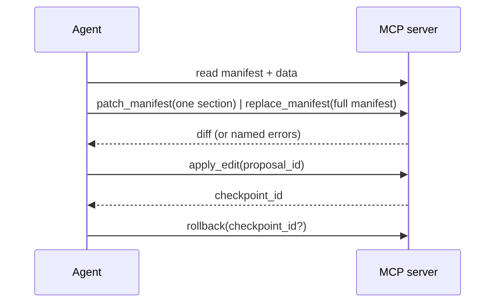

The MCP server is how an **agent** maintains a dashboard: safely, for months, without it
rotting. It's the primary way to run OpenIslands. It exposes the same typed, validated path the
CLI uses as a set of tools over the Model Context Protocol, built on one principle:

> **Read many, write one.** An agent can read everything (the manifest, the schemas, the live
> data), but every change funnels through a single proposal-and-apply pipeline that validates
> before it writes and snapshots before it changes anything.

This is the moat. An agent can't hand-edit your files, can't ship a broken binding, and can't
make a change you can't undo.



## Wiring it up

The server ships as `@openislands/mcp`. Point your MCP client's config at your **project root** —
the workspace that holds your apps under `apps/<id>/`:

```jsonc title=".mcp.json"
{
  "mcpServers": {
    "openislands": {
      "command": "npx",
      "args": ["-y", "@openislands/mcp", "/path/to/your/project"]
    }
  }
}
```

The first positional argument is the project root: the server scans `apps/*`, and reads and writes
each app's manifest, data, and history under `apps/<id>/`. `npx` fetches and runs the latest
published server on demand; its `-y` flag skips the install prompt, so there's nothing to install
globally.

One server hosts the whole workspace. App-scoped tools take an optional **`app`** param naming
which app to act on; omit it when the project has a single app and it resolves automatically. With
several apps, pass `app`, or you get an error naming the available ids — call `list_apps` first to
discover them.

## Running over HTTP

The config above runs the server over **stdio** — the client spawns it as a child process. For a
remote or always-on setup, the same server also speaks **Streamable HTTP** (the modern MCP
transport): `openislands serve --mcp`, or the [Docker image](/self-hosting), mounts it on the
dashboard's port at `POST/GET/DELETE /mcp`. One endpoint hosts the whole workspace — pick the app
with the `app` tool param, not the URL. An HTTP-aware client points its `url:` at that endpoint
instead of spawning a command; the tool surface below is identical either way. Off loopback it
requires a bearer token — see [Self-hosting](/self-hosting) for the full deployment and security
story.

## Apps

A project is a **workspace**: every app lives under `apps/<id>/`, and one server hosts them all.
Three project-level tools manage the set (they take no `app` param — they operate on the
workspace):

| Tool | What it does |
| --- | --- |
| `list_apps` | Lists the apps in the workspace — `{ apps: [{ id, title, dir }] }`. Call it first when a project might hold more than one app, then pass the chosen `id` as the `app` param on the app-scoped tools below. |
| `create_app({ id, title? })` | Scaffolds `apps/<id>/` with a minimal starter manifest (one welcome note, empty `data/`). Errors if the `id` is unsafe or already taken. |
| `delete_app({ id })` | **Soft-archive** — moves `apps/<id>/` into the workspace's `.openislands/trash/`. It's reversible (nothing is hard-deleted) but flagged destructive, so a client confirms before it runs. |

Two read-only **resources** expose the same surface for clients that prefer resource reads to tool
calls: `openislands://apps` (the app list) and `openislands://apps/<id>/manifest.json` (one app's
current manifest).

Everything below is **app-scoped**: each tool takes an optional `app` param naming which app to act
on. Omit it in a single-app project — it resolves to the sole app. The two registry tools
(`list_islands`, `get_island_schema`) are app-independent and take no `app`.

## The read tools

An agent grounds itself before it ever proposes a change. These tools are all read-only:

| Tool | What it returns |
| --- | --- |
| `get_overview` | **Start here.** The manifest, every dataset's live columns, and the declared actions / queries / connectors (with status), plus the rollback checkpoint count — one call instead of a `get_manifest` + a `get_data_schema` per dataset + `list_actions` / `list_queries` / `list_connectors` fan-out. Concise by default; pass `verbosity: 'detailed'` to also include per-action row schemas and per-query params + result columns. |
| `list_islands` | The built-in island types, the fields each requires, and each one's `minSpan` / `recommendedSpan` / `maxSpan`. |
| `get_island_schema(type)` | The exact config schema for one island type, plus its `layout` (`{ minSpan, recommendedSpan, maxSpan }`) and `notes` — so the sizing rules reach you at discovery time. |
| `get_manifest` | The current manifest. |
| `get_data_schema(dataset)` | A dataset's live, DuckDB-inferred columns and types. |
| `run_sql({ dataset } \| { sql }, limit)` | Rows from a dataset, or a read-only `SELECT` over the registered dataset views. |
| `validate_sql({ sql })` | Dry-runs a read-only `SELECT` against the dataset views; returns its result columns or the exact DuckDB error. |
| `validate_manifest({ manifest? })` | Validates a manifest (the one on disk, or one you pass) and checks every binding against the data; also returns advisory layout `warnings`. |
| `list_checkpoints` | The rollback points, newest last. |

**Every tool returns a JSON object** carrying an `ok` flag. On `ok:false`, read `error` (or
`errors` — each names the page, island, and field) and fix it; `isError` is reserved for an
unexpected failure, never a validation miss. The structured read and proposal tools (the lists,
`run_sql` / `run_query`, the `validate_*` checks, and the staging tools) also return
`structuredContent` validated against a declared `outputSchema`, so a client can consume them
without re-parsing text.

`run_sql` takes a `dataset` name for a whole dataset *or* a read-only `sql` SELECT over the
dataset views, never both — it pairs with `validate_sql` (the dry-run) and is the ad-hoc
counterpart to `run_query` (a *saved, named, parameterized* read). Both are row-capped and take a
`verbosity` (`concise` default / `detailed`) that widens the output token budget. This is how an
agent confirms a column exists and what its values look like *before* binding an island to it.

`validate_sql` is the same read-only surface, aimed at **authoring a transform**: paste the SQL you
intend to save as a `sql` dataset and get back its result columns, or the exact DuckDB error, before
you wire it into the manifest. See [CRUD recipes](#crud-recipes).

`get_island_schema` and `list_islands` also carry each island's **span range** — its `minSpan`,
`recommendedSpan`, and `maxSpan` on the 12-column grid — so you can size a tile correctly before you
set `span`, not after `validate` rejects it. Compact islands (a `metric.kpi`, `funnel.steps`, the
gauges) cap well below 12; data-dense ones run the full width. See
[Spans and the grid](/concepts/manifest#spans-and-the-grid).

## The manifest write path

Exactly one pipeline writes the manifest, in two steps with a human-reviewable diff between
them. An agent stages an edit (`patch_manifest` or `replace_manifest`), reviews the returned diff,
then applies it.

| Tool | What it does |
| --- | --- |
| `patch_manifest({ ... })` | **The preferred editor.** Merges one or more sections into the current manifest, validates the result, and stages it. |
| `replace_manifest({ manifest })` | Stages a **full** manifest rewrite. |
| `apply_edit({ proposal_id })` | Writes a staged proposal and snapshots the prior manifest. |
| `rollback({ checkpoint_id? })` | Restores a snapshot byte-for-byte (the latest if no id). |

### `patch_manifest` — the incremental editor

`patch_manifest` is how an agent should normally edit the manifest. It takes a **partial**
manifest — `{ title?, icon?, datasets?, actions?, queries?, connectors?, pages?, remove_pages? }` —
merges it into the document on disk, validates the merged result against the live data, and returns
a unified `diff` plus a `proposal_id` (it writes **nothing** yet). You never re-send, or re-typo,
the whole manifest.

The merge follows the shape of each section:

- **Record sections** (`datasets`, `actions`, `queries`, `connectors`) are keyed maps. Each entry is
  upserted by name: `name → spec` adds or replaces that one entry, and **`name → null` deletes it**.
  Untouched entries are left alone.
- **`pages`** is a list, so it's upserted **by `id`**: a page whose `id` already exists is replaced,
  a new `id` is appended. **`remove_pages: ["id", …]`** deletes pages by id.
- **Scalars** (`title`, `icon`) are overwritten when present.

```jsonc
// patch_manifest — add one dataset and one page, delete a stale query, all in one call
{
  "datasets": { "spending": { "source": "data/spending.csv", "description": "monthly spend" } },
  "pages": [
    { "id": "spending", "title": "Spending", "islands": [
      { "type": "category.bar", "title": "By category", "dataset": "spending",
        "x": "category", "y": "amount_eur" }
    ] }
  ],
  "queries": { "legacy_rollup": null }
}
```

The validation is identical to `replace_manifest`'s: if a binding fails, you get
`{ ok: false, errors, diff }` (each error naming the page, island, and field) and **no**
`proposal_id`. Fix the patch and call again. On success: `{ ok: true, proposal_id, diff }`. Both
shapes also carry an advisory **`warnings`** array — the layout linter's non-blocking suggestions
(a lone `metric.kpi`, a compact island stretched past its recommended span). Warnings never set
`ok` to `false` or block the apply; they're a nudge toward a tidier layout, not a gate.

### `replace_manifest` — the full rewrite

**`replace_manifest({ manifest })`** takes the whole manifest when you really do want to replace it
end to end. It accepts a manifest **object** (preferred) or a JSON string — no double-encoding.
It validates the structure, checks every binding against the live data, and returns the same
`{ ok, proposal_id?, diff, errors?, warnings? }` shape as `patch_manifest`. **Reach for
`patch_manifest` first** — it's the preferred incremental editor; `replace_manifest` is for a full
rewrite or a brand-new manifest, where re-sending the whole document is the point.

A proposed manifest is validated **against itself**: new datasets, `sql` transforms, and markdown
sources introduced in the same edit resolve and bind correctly, even starting from an empty
manifest. `validate_manifest({ manifest? })` runs that same check (errors **and** advisory layout
`warnings`) without staging anything — pass a manifest object to dry-run it, or omit it to validate
the one on disk.

### Apply and roll back

**`apply_edit({ proposal_id })`** writes a staged proposal (from either editor). Before writing it
**snapshots the current manifest** as a checkpoint and returns its `checkpoint_id`. A proposal is
rejected if it's unknown or **stale**: if the manifest on disk changed since it was staged (a
content-hash check), re-stage the edit.

**`rollback({ checkpoint_id? })`** restores a checkpoint **byte-for-byte** (the latest if no id is
given). It restores the manifest *and* any data checkpoints, so it undoes data writes too.

History doesn't grow without bound: it auto-prunes to the newest few checkpoints after every
`apply_edit`. **`prune_checkpoints({ keep? })`** prunes it on demand — keeping the newest `keep`
checkpoints and deleting the rest — to reclaim space sooner or keep fewer. Trimmed checkpoints
become unrecoverable.

There is no raw file-write tool and no git dependency by design. Safety is the
stage/apply/rollback loop plus on-disk snapshots, not trust.

## CRUD recipes

Author against the live contract, stage with `patch_manifest`, apply.

**Add a dataset from a file.** Drop the file under `data/` (or `models/` / `docs/` / `app/`), then
upsert it and confirm its inferred columns:

```jsonc
// patch_manifest
{ "datasets": { "crypto": { "source": "data/crypto.csv", "description": "holdings" } } }
```

Then `get_data_schema({ dataset: "crypto" })` before you bind an island to it.

**Add a SQL transform — dry-run it first.** `validate_sql` lets you get the SQL right before it ever
touches the manifest:

```jsonc
// 1. validate_sql — returns the result columns, or the exact DuckDB error
{ "sql": "SELECT class, SUM(value_eur) AS value_eur FROM holdings GROUP BY class" }

// 2. once it's valid, save it under models/ and wire it in with patch_manifest
{ "datasets": { "allocation": { "sql": "models/transforms/allocation.sql" } } }
```

A transform can read any other dataset by its name; `validate_sql` resolves those same views.

**Add an island to a page.** A page is upserted by `id`, so read the page, append the island, and
send just that page back (everything you omit on the page is replaced, so include the existing
islands):

```jsonc
// patch_manifest
{ "pages": [ { "id": "overview", "title": "Overview", "islands": [
    /* ...existing islands... */,
    { "type": "rank.list", "title": "Top assets", "dataset": "allocation",
      "label": "class", "value": "value_eur", "span": 6 }
] } ] }
```

**Remove something.** Set a record entry to `null`, or list page ids in `remove_pages`:

```jsonc
// patch_manifest
{ "queries": { "by_class": null }, "actions": { "log_txn": null }, "remove_pages": ["scratch"] }
```

## The data write path: actions

Actions are typed inserts into a `source` dataset, declared in the manifest. The agent
discovers and runs them:

- **`list_actions`** returns each declared action with its **resolved row JSON Schema**
  (derived from the live data, merged with the action's `fields` overrides). This is the
  agent's grounding for what a valid row looks like.
- **`run_action(name, rows)`** validates **every** row against that schema first. A single bad
  row rejects the whole call with an error naming the row index and field, and **nothing is
  written.** On success the target file is snapshotted (so `rollback` covers it) and the
  result reports the rows `inserted` plus a `checkpoint_id`.

Inserts are all-or-nothing and path-confined to the project: an action can only write the
`source` file its declared dataset names.

## The read query path: queries

Queries are typed, read-only reads over a dataset, declared in the manifest. They're the read
mirror of actions: a saved, named, parameterized version of `run_sql`. A query is a declarative
spec — a dataset, filters, a projection — that the compiler translates to a parameterized
`SELECT`, not raw SQL. The agent discovers and runs them:

- **`list_queries`** returns each declared query with its `name`, `description`, its `params` as a
  **JSON Schema**, and the result `columns`. This is the agent's grounding for what to pass and
  what comes back.
- **`run_query({ name, params?, limit? })`** validates the params, then runs the compiled `SELECT`.
  On success it returns `{ ok: true, rowCount, columns, rows }`. A bad param rejects the whole call
  with `{ ok: false, errors }` (all-or-nothing); an unknown name or a query error returns
  `{ ok: false, error }`. `limit` is 1–500 and the result is row-capped either way. Params and
  literals are bound, never interpolated, and every `field` is validated against the live columns.

A query is plain JSON in the manifest. Because the only thing the write path writes is the
manifest, an agent authors a query through the normal `patch_manifest` / `apply_edit` loop, exactly
like an island or an action — it creates the read tool, it doesn't just run one.
See [Queries](/data/queries) for the full shape.

## Connectors

Connectors sync an external provider's data into `source` datasets on a schedule, through the
same checkpointed write path. The agent's two tools:

- **`list_connectors`** returns each connector's live status: `connected`, `missingSecrets`,
  `lastSync`, `lastError`, effective `schedule`, and any `loadError`. This is how an agent
  discovers that auth is missing.
- **`run_sync({ name })`** pulls from the provider and writes rows, returning rows-per-dataset,
  the write mode (`insert` / `replace`), and a `checkpoint_id`, so a sync is reversible with
  `rollback`.

<Callout type="warn" title="Authorization is human-only">

OAuth runs in the dashboard browser, not from the agent. If `list_connectors` shows a connector
isn't `connected` (OAuth not completed, or secrets missing), the agent must tell you to open the
dashboard (`openislands serve`) and click **Connect**. It must never attempt to authorize on its
own.

</Callout>

## Safety posture

Every guarantee is structural, not advisory:

- **Validate before write.** `patch_manifest`, `replace_manifest`, and `run_action` all fail closed:
  an invalid manifest or a bad row never reaches disk.
- **Snapshot before change.** `apply_edit`, `run_action`, and `run_sync` each snapshot to
  `.openislands/history/` first, and `rollback` restores any of them byte-for-byte. History is
  count- and byte-capped, oldest pruned first.
- **Path confinement.** Writes are scoped to the project's declared `source` files; there is
  no general filesystem access.
- **Reads are bounded too.** `run_sql` and `run_query` only run read-only `SELECT`s; a query
  compiles from a declarative spec with its `field`s validated and its params and literals bound,
  not interpolated, and every result is row-capped.
- **Prompt-injection posture.** Because the *only* mutations are a validated manifest edit
  (`patch_manifest` or `replace_manifest`) and a schema-checked row insert — both diffed or reported,
  both reversible — data that tries to talk an agent into a harmful edit still can't bypass
  validation, the diff, or the rollback snapshot.

## Related

- [Getting Started](/getting-started): the human CLI loop the MCP tools mirror.
- [The Manifest](/concepts/manifest): what `replace_manifest` validates.
- [Data Contracts](/concepts/data-contracts): the binding check behind every write.
