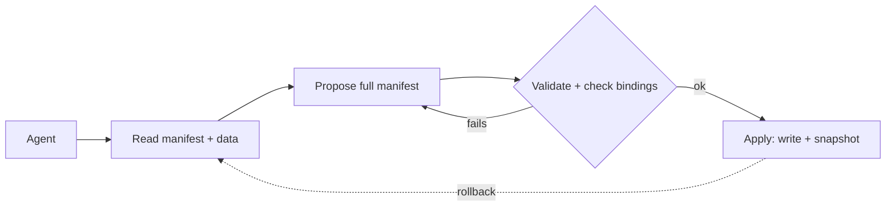

# Getting Started

OpenIslands is built for an **agent** to own a dashboard: point it at a project and let it build
and maintain it over months, through a typed edit loop that validates every change and can undo
any of them. That's the primary path, and it's where this page starts. Prefer to drive it
yourself? Jump to [the CLI](#prefer-the-keyboard-the-cli).

## Let an agent build it

The agent works over the `@openislands/mcp` MCP server. It reads the manifest and the live data,
proposes a change as a **full** manifest, sees a diff, applies it, and rolls back if the change
was wrong. It can't hand-edit a file or ship a broken binding. That loop is the whole product.



::::steps

##### Wire up the MCP server

Point your MCP client at the project directory (the folder that holds `app/manifest.json`).
`npx -y` fetches and runs the latest published server with no install.

```jsonc [.mcp.json]
{
  "mcpServers": {
    "openislands": {
      "command": "npx",
      "args": ["-y", "@openislands/mcp", "/path/to/your/project"]
    }
  }
}
```

You need a project to point at. If you're starting from scratch, scaffold one first with
[`init`](#scaffold-a-project) — an empty directory with an `app/manifest.json` works too.

##### Serve the dashboard

In the project, boot the live runtime so you can watch the agent's edits land:

```bash
npx openislands serve
```

This renders the dashboard at [127.0.0.1:4321](http://127.0.0.1:4321), querying your files on
every request. Leave it running — an applied edit live-updates the page over SSE.

##### Let the agent ground itself

Ask the agent to look before it builds. Its read tools are `get_manifest`, `list_islands` and
`get_island_schema(type)` for what each island needs, `get_data_schema(dataset)` and
`query_data` to see real columns and values, and `list_checkpoints` for the rollback points.
This is how it confirms a column exists *before* binding an island to it.

##### Have it propose a change

The agent calls `propose_edit` with the **full** manifest. The server validates the structure
and checks every binding against the live data, then hands back a unified `diff` — and writes
nothing yet. A binding to a column that doesn't exist comes back as a named error (the page,
the island, the missing field) with no proposal id, and the agent fixes it and proposes again.

##### Apply, then roll back if it's wrong

`apply_edit(proposal_id)` writes the manifest and snapshots the prior version as a checkpoint.
Your running `serve` reflects it instantly. If the result is wrong, `rollback(checkpoint_id?)`
restores a snapshot byte-for-byte — the latest if you don't name one.

::::

That loop runs as long as you keep the agent pointed at the project: it adds islands, wires in
new files, and fixes bindings without the app rotting. The same MCP surface drives data writes
([actions](/data/actions)) and provider syncs ([connectors](/data/connectors)), both reversible
through the same snapshots.

:::tip
Read [MCP Server](/mcp) for the full tool surface and the safety posture behind it.
:::

## Prefer the keyboard? The CLI

Everything the agent does maps to a CLI command, and you can drive the whole thing by hand. The
rhythm is **infer fast, formalize immediately**: see a file's shape with no commitment, then bind
it, add an island, and validate.

::::steps

##### Scaffold a project

Pick a template (`finance`, `health`, or `operations`); `init` drops a complete, working project
in the target directory.

```bash
npx openislands init my-dashboard --template finance
cd my-dashboard
```

`finance` is the flagship: net worth, allocation, holdings, and transactions as typed islands
over CSVs you own. Swap in `--template health` or `--template operations` for the others.

:::tip
No global install needed — `npx openislands` runs the latest CLI. Install it
(`npm i -g openislands`) once you're using it daily.
:::

##### Serve it

```bash
npx openislands serve
```

`serve` validates the manifest, then boots the live runtime at
[127.0.0.1:4321](http://127.0.0.1:4321): a real local dashboard, server-rendered, querying your
files on every request. It binds to loopback by default (this is your data) and refuses to boot
if the manifest can't render, naming what's wrong. Edit a file and the page live-updates over
SSE.

##### Drop in a file and infer its shape

Move a CSV (or JSON / JSONL / Parquet) into `data/`, then ask the CLI what's in it:

```bash
npx openislands infer data/spending.csv
```

`infer` reads the file through the same DuckDB core the runtime uses and prints a preview: the
**inferred columns and types**, a **proposed dataset contract** (`{ "spending": { "source":
"data/spending.csv" } }`), and **suggested islands** to render it. Nothing is written; it's a
read-only look.

##### Formalize it

When the preview looks right, re-run with `--bind` to write the dataset into your manifest:

```bash
npx openislands infer data/spending.csv --bind
```

This adds `spending` to `app/manifest.json` and re-validates before saving, so a bad write is
refused, not persisted. Then scaffold an island and point it at the new dataset:

```bash
npx openislands add category.bar
```

`add` appends an island skeleton to your first page (any built-in type works). Open
`app/manifest.json`, set the island's `dataset` to `spending`, and fill in its required fields
(here, `x` and `y`) from the columns `infer` showed you.

##### Validate

```bash
npx openislands validate
```

`validate` checks the manifest and every island's binding against the live data. A binding to a
field that doesn't exist fails here and **names the island** — the same check the agent's
`propose_edit` runs. Green means the dashboard renders, and your running `serve` already reflects
it.

::::

## Where to go next

- [MCP Server](/mcp): the agent edit loop in full, and why each guarantee is structural.
- [The Manifest](/concepts/manifest): the mental model behind that JSON file.
- [Data Contracts](/concepts/data-contracts): how datasets are typed, and how SQL transforms
  shape data before it reaches an island.
- [Islands](/islands/overview): the visual building blocks, with live previews.
