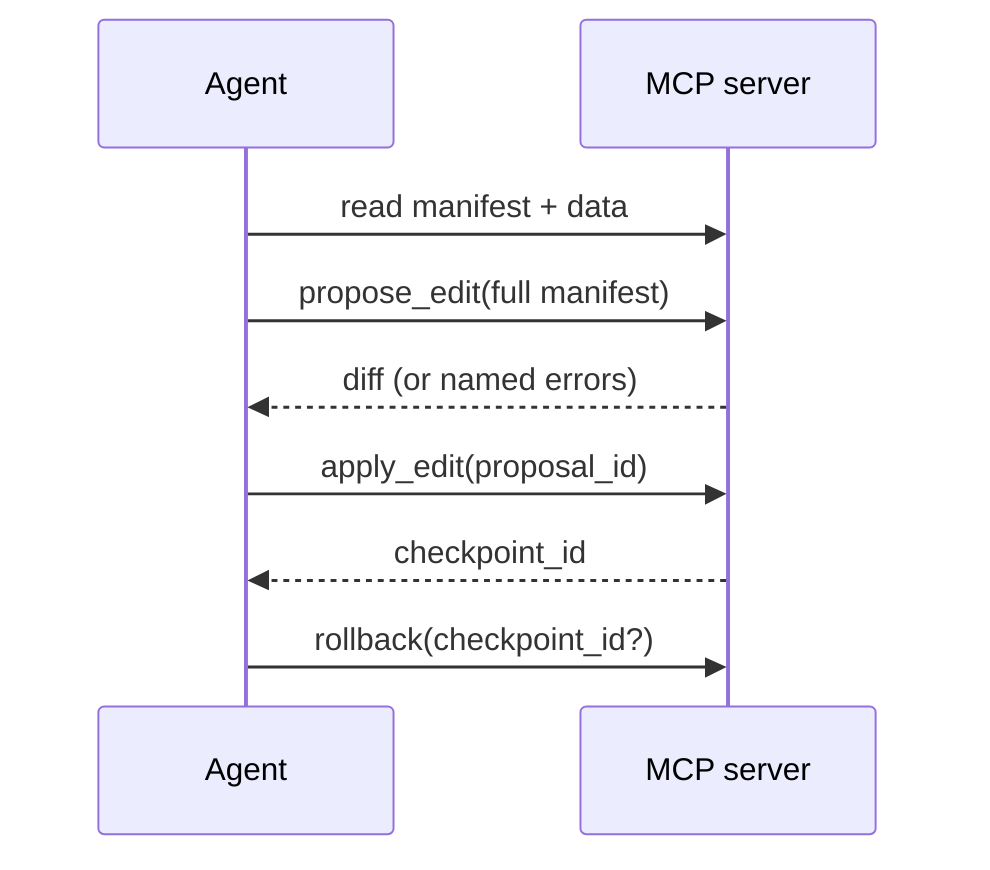

# MCP Server

The MCP server is how an **agent** maintains a dashboard: safely, for months, without it
rotting. It's the primary way to run OpenIslands. It exposes the same typed, validated path the
CLI uses as a set of tools over the Model Context Protocol, built on one principle:

> **Read many, write one.** An agent can read everything (the manifest, the schemas, the live
> data), but every change funnels through a single proposal-and-apply pipeline that validates
> before it writes and snapshots before it changes anything.

This is the moat. An agent can't hand-edit your files, can't ship a broken binding, and can't
make a change you can't undo.



## Wiring it up

The server ships as `@openislands/mcp`. Point your MCP client's config at your project
directory (the folder that contains `app/manifest.json`):

```jsonc
// .mcp.json
{
  "mcpServers": {
    "openislands": {
      "command": "npx",
      "args": ["-y", "@openislands/mcp", "/path/to/your/project"]
    }
  }
}
```

The first positional argument is the project root: the server reads and writes the manifest,
data, and history under it. `npx` fetches and runs the latest published server on demand; its
`-y` flag skips the install prompt, so there's nothing to install globally.

## The read tools

An agent grounds itself before it ever proposes a change. These tools are all read-only:

| Tool | What it returns |
| --- | --- |
| `list_islands` | The built-in island types and the fields each requires. |
| `get_island_schema(type)` | The exact config schema for one island type. |
| `get_manifest` | The current manifest. |
| `get_data_schema(dataset)` | A dataset's live, DuckDB-inferred columns and types. |
| `query_data({ dataset } \| { sql }, limit)` | Rows from a dataset, or a read-only `SELECT` over the registered dataset views. |
| `validate_manifest` | Validates the current manifest and checks every binding against the data. |
| `list_checkpoints` | The rollback points, newest last. |

`query_data` takes a `dataset` name for a whole dataset *or* a read-only `sql` SELECT over the
dataset views, never both. This is how an agent confirms a column exists and what its values
look like *before* binding an island to it.

## The manifest write path

Exactly one pipeline writes the manifest, in two steps with a human-reviewable diff between
them:

1. **`propose_edit(manifest)`** takes the **full** manifest as a string. It validates the
   structure and checks every binding against the live data, then returns a unified `diff`,
   but does **not** write. If the data check fails it returns `{ ok: false, errors, diff }`
   (each error naming the page, island index, type, and missing field) and **no**
   `proposal_id`; the agent fixes the binding and proposes again. On success it returns `{ ok:
   true, proposal_id, diff }`.
2. **`apply_edit(proposal_id)`** writes that proposal. Before writing, it **snapshots the
   current manifest** as a checkpoint and returns its `checkpoint_id`. A proposal is rejected
   if it's unknown or **stale**: if the manifest on disk changed since it was proposed (a
   content-hash check), the agent must re-run `propose_edit`.

**`rollback(checkpoint_id?)`** restores a checkpoint **byte-for-byte** (the latest if no id is
given). It restores the manifest *and* any data checkpoints, so it undoes data writes too.

There is no raw file-write tool and no git dependency by design. Safety is the
proposal/apply/rollback loop plus on-disk snapshots, not trust.

## The data write path: actions

Actions are typed inserts into a `source` dataset, declared in the manifest. The agent
discovers and runs them:

- **`list_actions`** returns each declared action with its **resolved row JSON Schema**
  (derived from the live data, merged with the action's `fields` overrides). This is the
  agent's grounding for what a valid row looks like.
- **`run_action(name, rows)`** validates **every** row against that schema first. A single bad
  row rejects the whole call with an error naming the row index and field, and **nothing is
  written.** On success the target file is snapshotted (so `rollback` covers it) and the
  result reports the rows `inserted` plus a `checkpoint_id`.

Inserts are all-or-nothing and path-confined to the project: an action can only write the
`source` file its declared dataset names.

## Connectors

Connectors sync an external provider's data into `source` datasets on a schedule, through the
same checkpointed write path. The agent's two tools:

- **`list_connectors`** returns each connector's live status: `connected`, `missingSecrets`,
  `lastSync`, `lastError`, effective `schedule`, and any `loadError`. This is how an agent
  discovers that auth is missing.
- **`run_sync({ name })`** pulls from the provider and writes rows, returning rows-per-dataset,
  the write mode (`insert` / `replace`), and a `checkpoint_id`, so a sync is reversible with
  `rollback`.

:::warning[Authorization is human-only]
OAuth runs in the dashboard browser, not from the agent. If `list_connectors` shows a connector
isn't `connected` (OAuth not completed, or secrets missing), the agent must tell you to open the
dashboard (`openislands serve`) and click **Connect**. It must never attempt to authorize on its
own.
:::

## Safety posture

Every guarantee is structural, not advisory:

- **Validate before write.** `propose_edit` and `run_action` both fail closed: an invalid
  manifest or a bad row never reaches disk.
- **Snapshot before change.** `apply_edit`, `run_action`, and `run_sync` each snapshot to
  `.openislands/history/` first, and `rollback` restores any of them byte-for-byte. History is
  count- and byte-capped, oldest pruned first.
- **Path confinement.** Writes are scoped to the project's declared `source` files; there is
  no general filesystem access.
- **Prompt-injection posture.** Because the *only* mutations are a validated full-manifest
  proposal and a schema-checked row insert (both diffed or reported, both reversible), data
  that tries to talk an agent into a harmful edit still can't bypass validation, the diff, or
  the rollback snapshot.

## Related

- [Getting Started](/getting-started): the human CLI loop the MCP tools mirror.
- [The Manifest](/concepts/manifest): what `propose_edit` validates.
- [Data Contracts](/concepts/data-contracts): the binding check behind every write.
